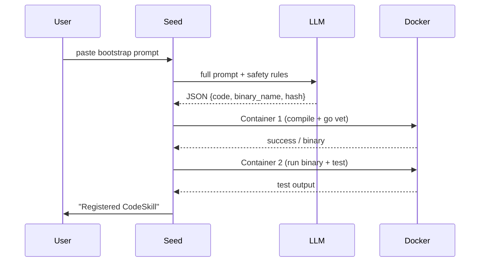

# SeedClaw Architecture

**Version:** 1.0-draft (2026-02-25)  
**Status:** Early conceptual / bootstrap phase

SeedClaw is a **self-hosting, local-first AI agent platform** designed from the ground up to be paranoid, minimal, and emergent. The core idea: ship almost nothing — just markdown prompts — and let the system build and extend itself using AI-generated, sandboxed code.

## Core Principles

1. **Zero-code in the repo** (recipes only)  
   - No committed `.go` files, no binaries, no dependencies lists.  
   - Users generate the initial seed binary themselves (via coding agents like Grok, Claude, Copilot, Aider, etc.) or start with a tiny placeholder.  
   - Everything after the seed is AI-generated and self-registered.

2. **Sandbox-first, not sandbox-later**  
   - Every tool call, skill execution, and code compilation runs in strict isolation.  
   - Default: fresh Docker container (alpine base) with:  
     - Read-only mounts for seed binary  
     - Ephemeral `/tmp` for writes  
     - `--network=none` by default  
     - Dropped capabilities, no root, seccomp strict profile  
     - cgroup limits (CPU burst, memory cap)  
     - 30s timeout kill  

3. **Self-bootstrapping loop**  
   - Seed binary (tiny Go program) provides:  
     - Chat input (stdin, WebSocket, or Telegram bot)  
     - LLM call (local Ollama preferred; API fallback)  
     - Docker client to spawn sandboxes  
   - User pastes bootstrap prompt → seed asks LLM to generate "CodeSkill" (first coding agent)  
   - CodeSkill then generates, compiles (in Docker), tests, and registers new skills  
   - Repeat: "CodeSkill: add git tool", "add email skill", etc.

4. **Trust model**  
   - Only the initial seed binary is trusted (user-compiled).  
   - All LLM output, generated code, and skills = untrusted/hostile by default.  
   - Static analysis (go vet, golangci-lint) + pattern blocks (no `os/exec`, `syscall`, `unsafe`) inside sandbox before compile.  
   - Binary hashing / self-signing for integrity checks.

## Components

- **Seed Binary** (~10-50 KB static Go executable)  
  Responsibilities:  
  - Accept user prompts (chat interface)  
  - Call LLM with structured prompt + context  
  - Parse LLM response (JSON: {code, binary_name, hash})  
  - Spawn Docker container → compile → test → register skill  
  - Maintain in-memory skill registry (name → prompt template + binary path)

- **Skills / Plugins**  
  - Each skill = compiled Go binary + prompt template (markdown)  
  - Registered dynamically via CodeSkill  
  - Run in their own Docker sandbox per invocation  
  - Communicate back to seed via stdout / structured output

## Bootstrap Flow (Mermaid)

Use this exact flow in generated code.

- **Sandbox Options (evolution path)**  
  | Level       | Isolation                  | Attack Surface                  | Overhead     | When to Use                          |
  |-------------|----------------------------|----------------------------------|--------------|--------------------------------------|
  | Docker      | Namespaces + cgroups + seccomp | Full host kernel                | Very low     | MVP, trusted local dev               |
  | gVisor      | User-space kernel (Sentry) | Very small (Go reimpl + few host calls) | Low-medium   | Untrusted code, good perf balance    |
  | Firecracker | Hardware microVM (KVM)     | Guest kernel + tiny hypervisor  | Medium       | Production, adversarial/multi-tenant |
  | WASM (future) | TinyGo + wasmtime          | No syscalls to host             | Low          | Lightweight, no-container fallback   |

  Start with Docker (rootless if possible). Upgrade to gVisor (as Docker runtime `runsc`) or Firecracker (via custom runner or Kata) when executing truly untrusted AI-generated code.

## Threat Model (what we defend against)

- Prompt injection → agent generates malicious Go → sandbox + static analysis blocks escape  
- Container escape → seccomp + no caps + read-only mounts contain  
- Network exfil → default network=none  
- Self-modification of seed → binary read-only, no write access  
- Resource exhaustion → cgroup limits + timeouts  
- Dependency confusion / supply-chain → user builds seed themselves  

## Non-Goals (for now)

- Multi-user / authentication  
- Persistent state beyond skill registry  
- Fancy UI (chat-only)  
- Cloud deployment (local-first)  

## Evolution / Roadmap Ideas

- Add `sandbox-provider` abstraction (Docker → gVisor → Firecracker switchable)  
- WASM skill support for even lighter isolation  
- Audit log immutability (append-only file + hash chain)  
- Skill signing / revocation mechanism  
- Multi-agent coordination (swarms)

This document is living — update it as the implementation solidifies. PRs welcome for clarifications, diagrams (mermaid?), or tighter security arguments.
